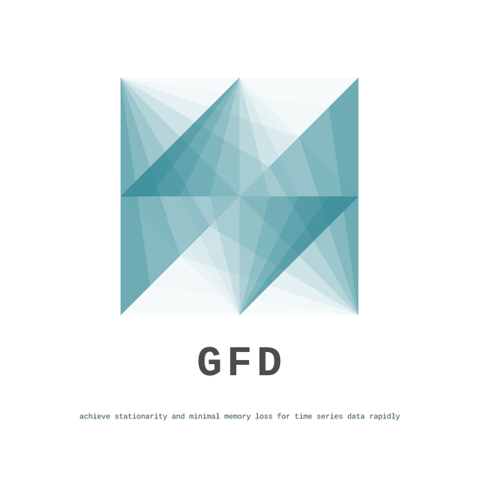

# Fractional Differencing with GPU (GFD)
<p align="center">
    
</p>


This is a GPU implementation of fractional differencing (we call it GFD). It allows rapid large-scale implementation of fractional differencing to minimize memory loss while achieving stationary for time series data.

## Experiment Our Code Instantly Now on Google Colaboratory

[](https://colab.research.google.com/github/ritchieng/fractional_differencing_gpu/blob/master/notebooks/gpu_fractional_differencing.ipynb)

Easily run the whole tutorial in a self-contained Jupyter Notebook on Google Colaboratory by pressing the button above. The whole process of including pulling all data, dependencies and running the code for GFD is contained in the notebook, allowing you to run this notebook as is.

## Simple GFD Function

We've created a simple function in the notebook, pass your Pandas dataframe into the function and it will return fractionally differenced time series dataframe.

### Arguments
- `d`: fractional differencing value, 0 means no differencing, above 1 means integer differencing, and anything between 0 to 1 is fractional differencing.
- `floor`: minimum value to ignore for fixed window fractional differencing.
    
### Notes
- Your dataframe (`df_raw`) is required to have an index such that it's from lag k (oldest time) to lag 0 (latest time) from top to the bottom of the dataframe accordingly for this function to work appropriately.
    - Future: We will implement auto-fixes moving forward such that you don't have to care about the order of your dataframe, but just take in the mean time.
- We tested for dataframes up to 100 million data points per function call (per dataframe essentially).

### GPU implementation

```python
gfd, weights = frac_diff_gpu(df_raw, d=0.5, floor=5e-5)
```

### CPU implementation

```python
fd, weights = frac_diff(df_raw, d=0.5, floor=5e-5)
```

## Summary Results
Number of data points and time taken in seconds.

 |**100k**|**1m**|**10m**|**100m**
:-----:|:-----:|:-----:|:-----:|:-----:
GCP 8x vCPUs|9.18|89.62|891.24|9803.11
GCP 1x T4 GPU|1.44|1.33|3.75|29.88
GCP 1x V100 GPU|0.93|1.07|3.17|23.81
 | | | | 
Speed-up 1x T4 vs 8x vCPUs|6.38|67.38|237.66|328.08
Speed-up 1x V100 vs 8x vCPUs|9.87|83.76|281.15|411.72

## Important Links to Presentation and Code Repository
- Code Repository: https://github.com/ritchieng/fractional_differencing_gpu
- Presentation: https://www.researchgate.net/publication/335159299_GFD_GPU_Fractional_Differencing_for_Rapid_Large-scale_Stationarizing_of_Time_Series_Data_while_Minimizing_Memory_Loss
- HTML Notebook (easy reading on mobile, collaboration with deep learning wizard): https://www.deeplearningwizard.com/machine_learning/gpu/gpu_fractional_differencing/

## GFD Repository Plans
- Make GFD more efficient
    - Chunk size implementation: currently just throwing the entire chunk matching the size of the dataset's length.
    - And more...
- Run GFD on thousands of time series datasets, creating a grid of t-stats and time benchmarks.
- Package GFD functions into a pip package for quick running

## Release Notes
This is an early beta release, we'll be releasing a stable release (v1.0) soon containing tests, more benchmarks, pip package and more. Please be patient!

## Citation Reference to Repository/Presentation
If you use the code, please cite using this [link](https://www.researchgate.net/publication/335159299_GFD_GPU_Fractional_Differencing_for_Rapid_Large-scale_Stationarizing_of_Time_Series_Data_while_Minimizing_Memory_Loss) alongside Prado/Hosking papers.

## Credits and Special Thanks
1. NVIDIA (Ettikan, Chris and Nick), Amazon AWS, ensemblecap.ai, and NExT++ (NUS School of Computing)
2. Marcos Lopez de Prado  for his recent push on the use of fractional differencing of which this guide is based on.
3. Hosking for his paper in 1981 on fractional differencing.

## Help Wanted
1. Feel free to raise any issue for feedback on bugs or improvements.
2. I'll be implementing more critical GPU-accelerated functions, we are looking for collaborators.
3. If you find this repository useful, please star it!
